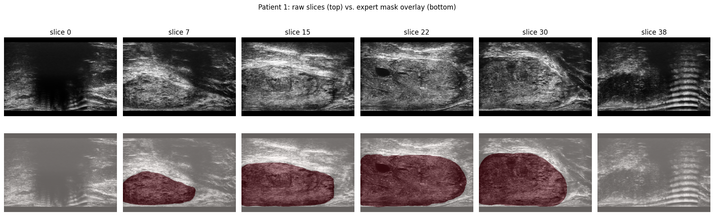
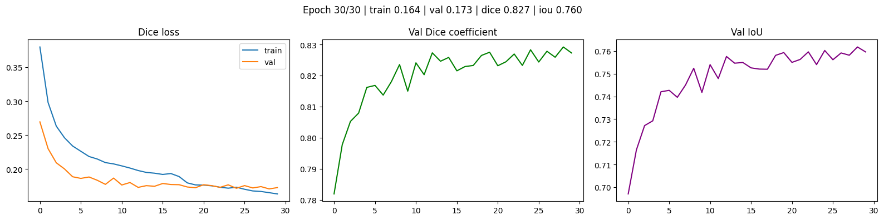
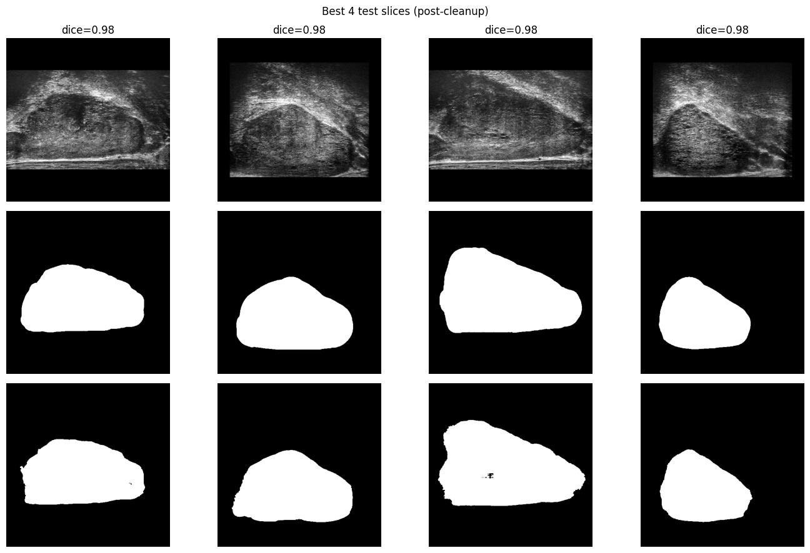
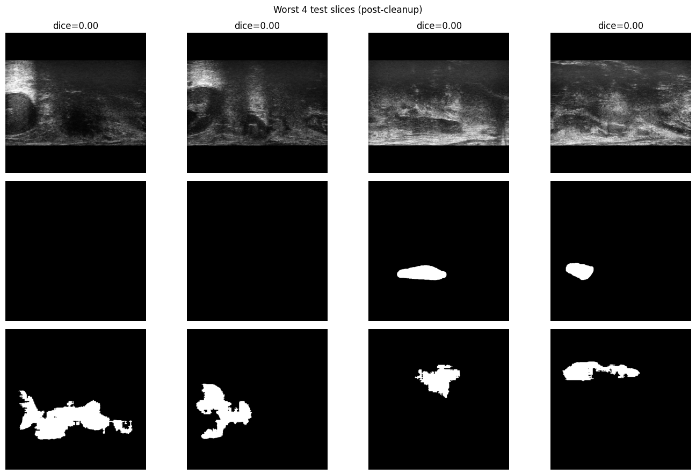
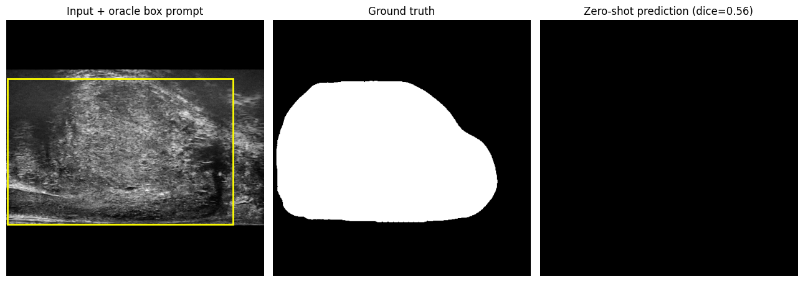
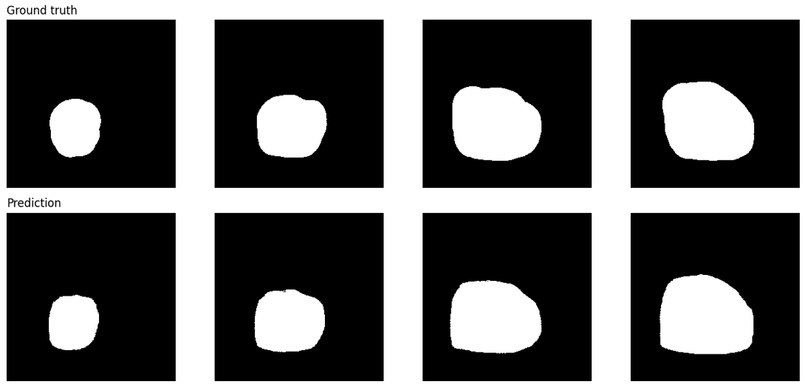

# MicroSAM-LoRA

### Parameter-Efficient Prostate Segmentation on Micro-Ultrasound

A from-scratch, two-phase medical image segmentation project: a VGG16-UNet CNN baseline
trained end-to-end from raw NIfTI volumes, then a LoRA fine-tune of MedSAM (a medical Segment
Anything model).

[](https://www.python.org/)
[](https://pytorch.org/)
[](https://huggingface.co/docs/transformers)
[](https://github.com/ujjawalsingh10/MicroSAM-LoRA/actions)
[](#)

---

## Highlights

- **CNN baseline that holds up against humans, not just a benchmark** — the UNet's agreement
  with the expert annotator (0.886 Dice) is at the top of normal inter-observer variability on
  this dataset, ahead of two of three independent human annotators.
- **Parameter-efficient fine-tuning of a real foundation model** — LoRA adapts MedSAM's 94M-parameter
  ViT-B encoder by training only 4.5M parameters (4.8%), lifting Dice from 0.557 (zero-shot) to
  0.968 on the held-out test set.
- **Real engineering, documented, not hidden** — a CUDA OOM root-caused to an exact tensor size,
  a silent post-processing bug caught because two different models produced suspiciously
  identical output, a dataset filename inconsistency handled with a defensive assertion. See
  [Engineering Journey](#engineering-journey) below.
- **Actually tested** — 16 unit tests covering loss functions, LoRA correctness, and data
  utilities, including a regression test for a real bug hit during development. All passing.


---

## Results

| Model | Setting | Dice | IoU | Notes |
|---|---|---|---|---|
| VGG16-UNet | Full test set, no prompt | **0.807** | 0.736 | Real deployment condition — image in, mask out, no hints |
| VGG16-UNet | Foreground-only test slices | 0.886 | 0.809 | For fair comparison against MedSAM below |
| MedSAM, zero-shot | Oracle box, foreground-only | 0.557 | 0.412 | No fine-tuning at all |
| **MedSAM + LoRA (r=8)** | Oracle box, foreground-only | **0.968** | **0.938** | 4.5M / 94.2M params trainable (4.8%) |


**A genuinely fair comparison, and the one worth remembering:** the model against three
independent human annotators on the same test set, none of whom got a box either.

| Annotator | Dice vs. expert |
|---|---|
| **This UNet** | **0.886** |
| Master's student | 0.882 |
| Clinician (limited micro-US experience) | 0.874 |
| Medical student | 0.832 |

---
## Visual Results

### Data & Annotator Agreement



### UNet Training

*Live loss curves and prediction preview*



### UNet Test-Set Results

*Best and worst test-set predictions*





### MedSAM: Zero-Shot vs. LoRA Fine-Tuned

#### MedSAM Zero-Shot



#### MedSAM with LoRA Fine-Tuning



<!-- ## LoRA Rank Ablation

*Pending — training in progress on Kaggle's free 30-hour GPU quota. This table will be filled
in with real Dice/IoU/trainable-param numbers across LoRA ranks once that run completes.*

| Rank (r) | Trainable Params | Trainable % | Dice | IoU | Notes |
|---|---|---|---|---|---|
| 4  | — | — | — | — | *pending* |
| 8  | 4,500,708 | 4.8% | 0.968 | 0.938 | Current default — see Results above |
| 16 | — | — | — | — | *pending* |
| 32 | — | — | — | — | *pending* | -->

---

## Two-phase approach

### Phase 1 — VGG16-UNet (CNN baseline)
A U-Net decoder on top of an ImageNet-pretrained, frozen VGG16 encoder. With ~1,700 training
slices from 44 patients, training a deep encoder from scratch invites overfitting, so only the
decoder is trained.

```
Input (512×512×3, padded to square before resize — no aspect-ratio distortion)
    │
    ▼
┌────────────────────────────────────────┐
│     VGG16 Encoder (frozen, ImageNet)    │
│  block1 ──────────────────────────┐     │
│  block2 ────────────────────┐     │     │
│  block3 ──────────────┐     │     │     │
│  block4 ────────┐     │     │     │ Skip│
│  block5 (bridge) │     │     │     │ Conn│
└────────┬─────────┘     │     │     │     │
    ┌────▼────┐     ┌────▼───┐│     │     │
    │ Dec 512 │     │Dec 256 ││     │     │
    └────┬────┘     └────┬───┘│     │     │
         └──────────┐    │  ┌─▼──┐  │     │
                     │    └──│D128│  │     │
                     │       └─┬──┘  │     │
                     │         │  ┌──▼──┐  │
                     └─────────┴──│D 64 │  │
                                  └──┬──┘  │
                                     │     │
                               Conv2D(1,1)+Sigmoid
                                     ▼
                           Binary Mask (512×512×1)

Loss: Dice Loss   |   Metrics: Dice, IoU, Precision, Recall, Accuracy
```

**Key design decisions, each tied to something found in EDA before writing model code:**
- **Patient-level train/val split**, not slice-level — adjacent slices from the same patient
  are highly correlated; a random slice-level split would leak information into validation.
- **Pad-to-square before resize**, not a direct resize — raw scans are 962×1372 (aspect ratio
  ≈0.70); resizing straight to 512×512 squashes the anatomy vertically.
- **Kept zero-foreground slices in training** (~11% of the data) so the model learns what
  "nothing here" looks like, not just positive examples.
- **Dice loss** — the prostate is a real but moderate minority class (~33% of pixels on
  slices where visible), so the case for Dice over BCE is boundary-overlap sensitivity, not
  extreme class imbalance.
- **Largest-connected-component post-processing** — measurably improved precision (+0.021)
  with negligible recall cost (−0.003), confirming stray predictions were genuinely spurious.

### Phase 2 — MedSAM + LoRA
LoRA injected into MedSAM's ViT-B vision encoder, with the mask decoder fully fine-tuned.

```
MedSAM (ViT-B backbone, wanglab/medsam-vit-base)
├── Vision Encoder [FROZEN, 89.7M params]
│   └── LoRA adapters in qkv + proj of all 12 attention blocks [TRAINABLE, ~442K]
├── Prompt Encoder [FROZEN, ~6.5K params — box → embedding, not worth tuning]
└── Mask Decoder [FULLY TRAINABLE, ~4.06M params]

Total: 94,178,096  |  Trainable: 4,500,708 (4.78%)
```

Those exact trainable-parameter counts were independently derived and verified against the
HuggingFace `transformers` library before any training code was written — not assumed from a
reference project's README.

**Key design decisions:**
- **`B` matrix zero-initialized** — LoRA contributes nothing at step 0; training starts from a
  known-good, numerically identical-to-pretrained state.
- **Box prompts derived from ground truth, jittered during training** — standard MedSAM
  fine-tuning practice. Only foreground slices are usable (no sensible box for an empty slice)
  — an architectural constraint, not a shortcut, and the reason MedSAM can't learn what the
  UNet learns (to predict absence).
- **Decoder-only cached baseline vs. full LoRA training, kept strictly separate** — see
  Engineering Journey below for why mixing these would silently break LoRA's gradients.

---

## Repository structure

```
MicroSAM-LoRA/
├── LICENSE
├── .github/workflows/tests.yml     # CI — runs pytest on every push
├── src/
│   ├── config.py                   # central paths & hyperparameters
│   ├── losses.py                   # DiceLoss, DiceBCELoss, metrics, keep_largest_component
│   ├── utils.py                    # seeding, headless plot saving
│   ├── data/
│   │   ├── preprocess.py           # NIfTI → PNG, patient-level split, dataset download
│   │   └── dataset.py              # ProstateDataset, MedSAMBoxDataset, box utilities
│   └── models/
│       ├── unet.py                 # VGG16UNet
│       └── lora.py                 # LoRALinear, injection, trainable-param counting
├── train_unet.py                   # Phase 1 training
├── evaluate_unet.py                # Phase 1 evaluation
├── train_medsam_lora.py            # Phase 2 training (decoder-only baseline + real LoRA)
├── evaluate_medsam.py              # Phase 2 evaluation (zero-shot / LoRA)
├── rank_ablation.py                # LoRA rank sweep (r=4/8/16/32), resumable across sessions
├── predict_unet.py                 # single-image inference
├── tests/                          # 16 tests, all passing
├── notebooks/                      # original 7 Colab notebooks — the exploratory record
└── docs/images/                    # README screenshots (tracked, unlike results/)
```

## Quick start

```bash
git clone https://github.com/ujjawalsingh10/MicroSAM-LoRA.git
cd MicroSAM-LoRA
pip install -r requirements.txt

# Download + preprocess the dataset (train/val split + official test set)
python -m src.data.preprocess --split both

# Phase 1 — VGG16-UNet
python train_unet.py --epochs 30
python evaluate_unet.py --foreground-only

# Phase 2 — MedSAM + LoRA
python train_medsam_lora.py --mode lora --r 8 --epochs 15
python evaluate_medsam.py --mode zero_shot
python evaluate_medsam.py --mode lora --r 8

# LoRA rank ablation (r=4/8/16/32) — resumable across sessions, see the script's docstring
python rank_ablation.py --ranks 4 8 16 32 --epochs 15

# Verify the core logic
pytest
```

Every script accepts `--help` for its full argument list (batch size, learning rate, LoRA
rank/alpha, early-stopping patience, etc.) — none of it is hardcoded.

## Dataset

[Micro-Ultrasound Prostate Segmentation Dataset](https://zenodo.org/records/10475293)
(Jiang, Hongxu et al., *MicroSegNet: A deep learning approach for prostate segmentation on
micro-ultrasound images*, Computerized Medical Imaging and Graphics, 2024) — 75 patients from
the University of Florida (55 train / 20 held-out test), CC-BY-4.0. The test split includes
independent annotations from a master's student, a medical student, and a urologist with
limited micro-ultrasound experience — used above for the human-agreement comparison.

---

## Engineering journey

Kept here deliberately, because catching and diagnosing these is the actual work.

**1. Inconsistent filenames across the dataset's test annotators.** Scans are named
`microUS_test_05.nii.gz`; the expert mask is `expert_annotation_test_05.nii.gz` — different
prefix, same trailing patient ID. Fixed by matching on the trailing numeric ID across folders
instead of exact filename, with an `assert` on expected match count so a naming inconsistency
fails loudly, not silently. See `extract_patient_num()` in `src/data/preprocess.py`.

**2. An embedding cache is only valid if what you cached stays frozen.** Precomputing image
embeddings once and reusing them is a real speedup — but only for parameters that never change.
Once LoRA is injected into the encoder, its output *is* changing every step. Verified directly
against the library (`model.get_image_embeddings()` / `model(..., image_embeddings=cached)`
provably skips the encoder's forward pass) and split training into two honest paths: a cached
decoder-only baseline (valid) and full uncached forward passes for LoRA (the only way its
gradients mean anything). See `train_decoder_only()` vs. `train_lora()` in `train_medsam_lora.py`.

**3. CUDA OOM, root-caused rather than retried.** Backprop through SAM's global-attention
blocks at 1024×1024 allocates a `(batch, heads, 4096, 4096)` tensor — the crash size (1.5 GiB)
matched `batch=4 × 12 heads × 4096² × fp16` almost exactly. Fixed at the source: freed a second
full MedSAM copy that was still resident on GPU, and switched to batch size 1 with 4-step
gradient accumulation to hold only one sample's activation graph in memory at a time.

**4. A silent "predict everything as foreground" bug.** `post_process_masks(...,
binarize=True)` defaults to a logit-space threshold (`mask > 0.0`), but the evaluation code was
passing already-sigmoided output — always strictly positive, so the threshold passed for nearly
every pixel. The tell: two structurally different models (zero-shot, fine-tuned) produced
*identical* metrics to four decimal places — a strong signal the bug was shared post-processing,
not the models. Confirmed against the library source before fixing.

**5. PyTorch 2.6's `weights_only=True` default broke checkpoint resume.** Metrics aggregated
with `np.mean()` are `numpy.float64`, outside the default safe-unpickling allowlist. Fixed by
casting to native `float` at the point of aggregation, so checkpoints never carry non-native
types in the first place.

---

## Testing

```bash
pytest tests/ -v
```

16 tests covering: Dice/DiceBCE loss behavior at both extremes, Dice/IoU metric correctness,
connected-component cleanup, LoRA's zero-init property (output must exactly match the frozen
base model before training), a **regression test for the device-mismatch bug** from item 3
above, gradient isolation (LoRA params receive gradients, frozen base params don't), and
box-prompt utility correctness.

## Limitations

- **Oracle box dependency (Phase 2):** every MedSAM number assumes a ground-truth-derived box
  prompt. A real deployment pipeline needs a separate way to produce that box — a detector, a
  clinician's click, or a fixed heuristic ROI — none of which is built here. The single most
  important caveat in this project.
- **No formal test-set number for decoder-only fine-tuning:** validation evidence (~0.963 Dice
  at 256px) suggests most of the gain over zero-shot comes from decoder training alone, with
  LoRA's encoder adaptation adding a smaller additional improvement — never confirmed on the
  held-out test set due to GPU time constraints during development. Stated as suggestive, not proven.
- **Single-institution dataset, single device:** generalization to other scanners/populations
  is untested.

## Future work

<!-- - ✅ ~~LoRA rank ablation (r=4/8/16/32)~~ — in progress, see [LoRA Rank Ablation](#lora-rank-ablation) above. -->
- Automatic box generation (a lightweight detector) to remove the oracle-box dependency.
- Formal test-set evaluation of the decoder-only baseline.

## Acknowledgments

- Dataset: Jiang et al., MicroSegNet (2024) — citation above.
- Base model: [MedSAM](https://huggingface.co/wanglab/medsam-vit-base) (Ma, Jun et al.), built
  on [Segment Anything](https://github.com/facebookresearch/segment-anything) (Meta AI).
- LoRA: Hu et al., *LoRA: Low-Rank Adaptation of Large Language Models* (2021).
